# Cancer projects and Multi Omics

- Nowadays it is possible to simultaneously make several [gen]omic measures in the same sample.
- Cancer genome projects have been at the forefront of this trend, and have faced the challenge of integrating these diverse data types [1,2], including _RNA transcriptional levels, genotype variation, DNA copy number variation, and epigenetic marks_

# Leary (2008), PNAS

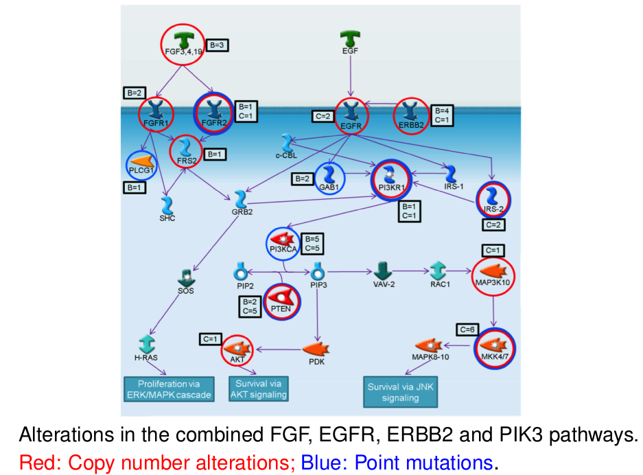

# Gene Sets & Gene Set Analysis

- Integration may be helped by annotated collections of gene sets capturing established knowledge about biological processes and pathways.
- Because one can make inferences about a given gene set using several different genomic data types, _Gene set analysis provides a direct and biologically motivated approach to analyzing multiple data types in an integrated way_
- There exist many collections of gene sets available, for example: the [Molecular Signatures Database at Broad Institute](http://software.broadinstitute.org/gsea/msigdb/collections.jsp)

# The Molecular Signatures Database


# Case study 1: Description

- The experiment is described in the paper by [Masuno 2011](#References).
- The dataset is hosted by GEO at: <http://www.ncbi.nlm.nih.gov/geo/query/acc.cgi?acc=GSE34313>
- Briefly, the investigators applied a glucocorticoid hormone to cultured human airway smooth muscle. 
    - The glucocorticoid hormone is used to treat asthma, as it reduces the inflammation response,
    - However it has many other effects throughout the different tissues of the body.

```{r example1, eval=FALSE}
require(GEOquery)
g <- getGEO("GSE34313")
e <- g[[1]]
e$condition <- e$characteristics_ch1.2
levels(e$condition) <- c("dex24","dex4","control")
lvls <- c("control", "dex4")
es <- e[,e$condition %in% lvls]
es$condition <- factor(es$condition, levels=lvls)
save (es, file=file.path("dades","GSE34313.Rda"))
```
# Traditional approach

- Usually all differential expression analyses follow a similar pipeline:
    + Find some feature-to-phenotype association score (say, using t-test, ANOVA, etc.)
    + Rank features according to the score and take top-'your favorite number' of differentially expressed genes. Discard the rest.
    + Adjust by Multiple testing

```{r example1Test, echo=TRUE, message=FALSE}
load(file=file.path("dades","GSE34313.Rda"))
library(limma)
design <- model.matrix(~ es$condition)
fit <- lmFit(es, design=design)
fit <- eBayes(fit)
tt <- topTable(fit, coef=2, genelist=fData(es)$GENE_SYMBOL, n=10000)
head(tt, n=5)
```

# Some obvious drawbacks

- Individual features (genes, proteins, miRNA) might not contribute too much to the difference between phenotypes, together, though, they might!
- It is not uncommon that similar studies report nonintersecting lists of "top genes"
- When selecting different types of features from the same study, connecting them is a complex task.

```{r drawbacks}
selected<- tt[(tt$adj.P.Val<0.01)&(abs(tt$logFC>1)),]
dim(selected)
```

# Gene Set Analysis

- Instead of 'list of genes' think about 'list of gene sets'
- Gene sets encompass larger amount of biological information,
this helps make results more interpretable.
- Information on the gene set level is comparable across different types of measurements (different platforms)
- Multiple testing issue atenuated: we will usually (not always...) have less sets than individual genes
- Same biological mechanisms can manifest in different parts of the pathway and via different alterations in different
subjects (!!!)

# Overrepresentation Analysis (OR Analysis)

  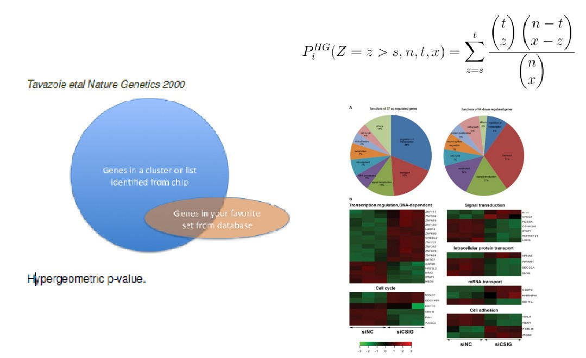


# OR Analysis Example


```{r ORA, message=FALSE, eval=FALSE}
 source(file.path(codeDir, "hiperGeometricAnalysisFunctions.R"))
        
 ORA <- function (aGeneList, aGeneUniverse, aCompName, aCutoff, anAnotPackage, anOutDir){
        hg1 <- newHyperPar(geneList=aGeneList, geneUniverse=aGeneUniverse,
                           anotPackage=anAnotPackage, sourceOnto="GO",
                           pValueCutoff=aCutoff, fileName=paste("hyperGTest", aCompName,sep="."))
        hg2 <- newHyperPar(geneList=aGeneList, geneUniverse=aGeneUniverse,
                           anotPackage=anAnotPackage, sourceOnto="KEGG",
                           pValueCutoff=aCutoff, fileName=paste("hyperGTest", aCompName,sep="."))
        hiperGeometricAnalysis (hg1, outDir=anOutDir)
        hiperGeometricAnalysis (hg2, outDir=anOutDir)
}
        
ORA (geneList1, universeList1, "DOXstudy", 0.01  , "org.Hs.eg.db", resultsDir)
```
# OR Analysis Analysis Example

  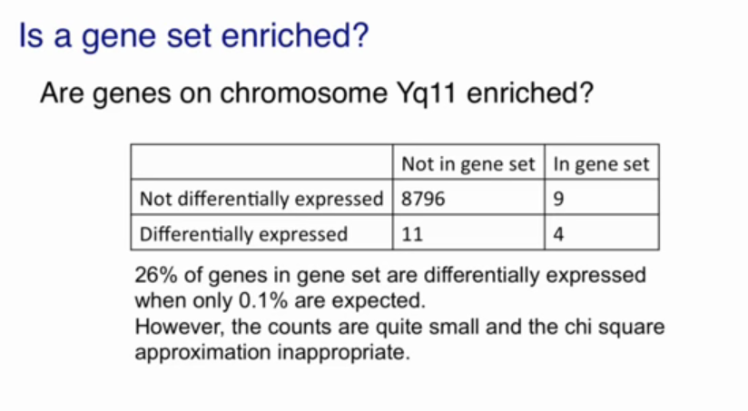

# Drawbacks of OR Analysis

- A small list of differentially-expressed genes that makes for the counts in the two by two tables relatively small, which makes the approximation that we used to obtain p values not very good.
- The definition of differentially-expressed is somewhat arbitrary. We picked a false discovery rate of 5%. We could have picked 10%, 25%, or some other number.
- It is not clear that there's a natural separation: 
    + we're going to have a number on the right side that's in the list of differentially-expressed. 
    + and right next to it a gene that is not in the list of differentially-expressed genes.
- There are alternatives

# Gene Set Enrichment Analysis. Motivation

- Imagine we are interested in another Gene Set, Chromossome XP11
- This particular gene set had only one out of the many genes in it called differentially-expressed.
- However, when we look at the distribution of t-statistics,
or the distribution of the effect size, we note that there's a slight shift to the left. 
- GSEA provides methods and tools to compute summary statistics that can be used to summarize effects such as this.
 
# Looking at the ChrX p11 gene set

 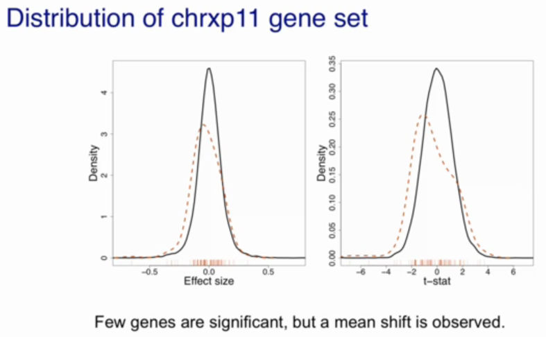
 

# Gene Set Analysis in more detail

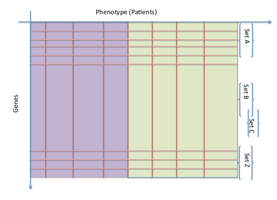

# A two-stage approach for GSEA

- __Stage I__: compute some gene to phenotype association scores 
(say, t-values) and rank genes according to these values.
- __Stage II__: check whether the distribution of the ranks is different in
a given set vs 
    + the set formed by the rest of the genes ('competitive null').
    + or vs the distribution of the ranks in the same set when there is no association with the phenotype ('self-contained null').
- Infer enriched sets, say by ranking sets according to the outcome of the
Mann-Whitney or Wilcoxon test. 

# Case study 2: Simple GSEA (1)

1. Load preprocessed data
2. Compute a t-test per each gene
3. Prepare binary data matrix for gene sets

```{r prepare4GSEA, message=FALSE}
dataDir <-file.path(".", "Rlabs/gene_set_testing/dades")
load(file=file.path(dataDir, "data4GSEA.Rda"))

require(genefilter)
rownames(expresHvsL)<-entrezs
tScores <-rowttests(expresHvsL, groupsHvsL, tstatOnly=TRUE)
head(tScores, n=3)

GSMatrix <- matrix(NA, nrow=length(entrezs), ncol=length(gsEntrez))
for (i in 1:length(gsEntrez)){
    GSMatrix[,i] <- entrezs %in% gsEntrez[[i]] # binaryGenSets[[i]]
}
GSMatrix <- GSMatrix*1
colnames(GSMatrix)<- names(gsEntrez)
rownames(GSMatrix)<- entrezs
head(GSMatrix, n=3)
```
# Case study 2: Simple GSEA (2)

- Decision about a geneset is overver or underrepresented is based on doing a Wilcoxon test 
    - using ttests scores as the response variable 
    - and the presence/absence of a gene in each set as grouping factor.

```{r doGSEA, message=FALSE}
  
for (i in (1:ncol(GSMatrix))){
    pOver <-wilcox.test(tScores$statistic~GSMatrix[,i], alternative="greater")$p.value
    pUnder <-wilcox.test(tScores$statistic~GSMatrix[,i], alternative="less")$p.value
    if ((pOver < 0.001)||(pUnder < 0.001)){
      cat(text2show <- paste("Gene Set ", i, ": ", colnames(GSMatrix)[i]),"\n")
      cat(paste(rep("=", rep(nchar(text2show))), collapse=""),"\n")
      if (pOver < 0.001) cat("\tTest for OverExpression :", pOver,"\n")
      if (pUnder < 0.001)cat("\tTest for UnderExpression :", pUnder,"\n")
    }
}

```

# Options for GSEA

-There are many options available. Most difficult option: choose amnong them.

- `Roast` Method
    - Included in limma. 
- Efron & Tibshirani: `GSA`
    - Included in SAM. 
    - Available for different experimental layouts: `Paired`, `Continuous`, `Survival`
- Broad Institute's: `
    - Classical GSEA
- Bioconductor: `PAGE`
    - Combines results with network visualization

# Suppose we have several data types

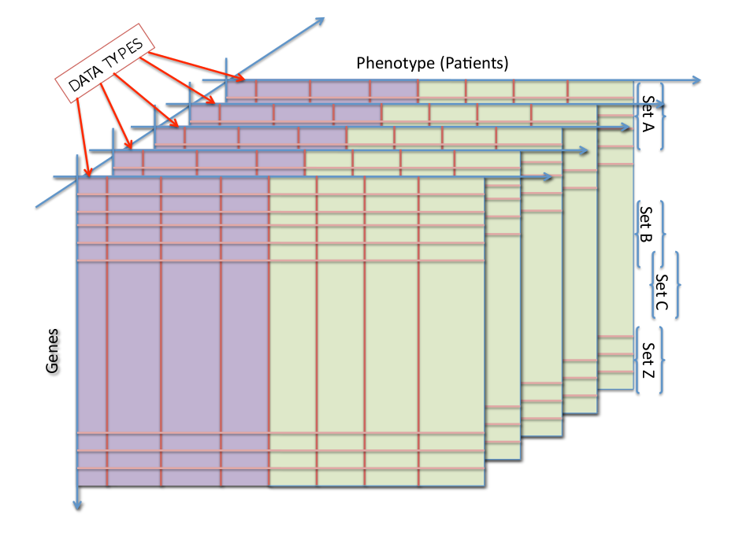

# Two possibilities for integration

- First integrate-then-GSEA (Integrative Approach or Stage I integration)
    + Compute gene-to-phenotype association scores using all available data types (say, using logistic regression or other linear model)

- First GSA-then-integrate (Meta-Analytic approach or Stage II integration)
    + Use, say, Wilcoxon p-values and take their geometric average, or take the
smallest one across all data types (some consensus measurement)

# Stage I integration in detail

- Heterogeneous data is integrated into a single gene-specific score 
$s_g(X^1, X^2, ..., X, Y)$, that draws from all the measurements available from gene $g$ across all the dimensions studied, 
- It is followed by one-dimensional GSA. 
$$
\phi(E(Y_i|X_{gi}^1,...,X_{gi}^ d )) = \sum_{d\in\{1,...,D\}} S_{gi}^d \beta_gi^ d
$$
where φ is a link function and i the biological sample. 
- For each gene, the Stage I score can be provided by a measure of the overall
fit of the model, say, a likelihood ratio for comparing this model to
the “null” model in which all the $\beta_g^d$ coefficients are zero. 
- In Stage II these scores can then be analyzed using traditional methods,
finally giving set-specific scores $t_s(s, M_s)$.

# Stage II integration: GSA + Integration

- This approach starts as a standard one-dimensional GSA: 
    + we determine a gene-to-phenotype association scores separately for each dimension $s_g^d(X^d, Y)$, 
    + and, in Stage II, we compute set-specific scores $t_s^d(s, M_s), d \in 1, ..., D$, for each dimension.
- Next these scores (e.g. p-values) can be integrated, say, by averaging:
$$
  t_s (s, M_s)= avg_{d\in \{1,...,D\}}t_s^d(s, M_s),
$$
when evidence of significance from several data types is needed, or
by taking the extremum score:
$$
  t_s (s, M_s)= max_{d\in \{1,...,D\}}t_s^d(s, M_s),
$$
when strong evidence from a single dimension seems to be sufficient

# Case studies and examples

- The R/Bioconductor package `RTopper` implements the different approaches described
    + [RTopper site in Bioconductor](https://www.bioconductor.org/packages/release/bioc/html/RTopper.html)
    +[RTopper Vignette](RTopper/RTopper.pdf)

- Aedin Culhane's 2012 Bioconductor course contains lots of information
    + [Aedin Culhane's 2012 Bioconductor course](http://bcb.dfci.harvard.edu/~aedin/courses/Bioconductor/)    
    + [A quick RTopper example](Rlabs/RTopper/simpleRTopper.R)
    
# References

- Irizarry et alt. GSEA made simple

- Masuno K, Haldar SM, Jeyaraj D, Mailloux CM, Huang X, Panettieri RA Jr, Jain MK, Gerber AN., "Expression profiling identifies Klf15 as a glucocorticoid target that regulates airway hyperresponsiveness". Am J Respir Cell Mol Biol. 2011.
<http://www.ncbi.nlm.nih.gov/pubmed/21257922>    

# Thanks for your attention


# Appendix: GSEA made simple's statistics suggestions

# GSEA made simple

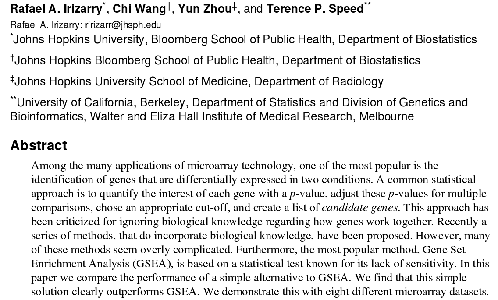

# (1) Wilcoxon test for over-under expression

Take each gene set and perform a wilcoxon test compared to the rest of the genes

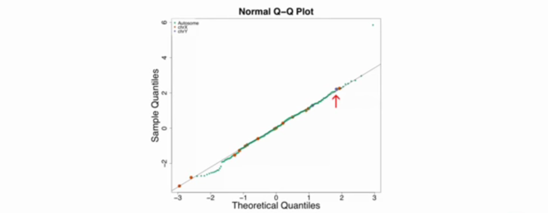

# (2) Simple test for the mean shift

- The simplest statistic to test for a mean shift is the average difference in mean.
- This difference may be summarized with average t-statistics

$$
\overline{t}=\frac 1N \sum_{i\in G} t_i, N=\mbox{size of gene set G}
$$

- If the t statistics are independent we have:

$$
\sqrt{N}\cdot \overline{t}\sim N(0,1)
$$ 

# (2) Average t-statistics

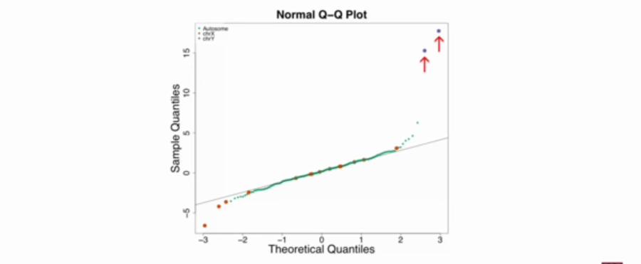

The two highest points are the two genesets in chromosome X and the three lowest points are the three genesets in chromosome Y

# (2') If gene sets are correlatied...

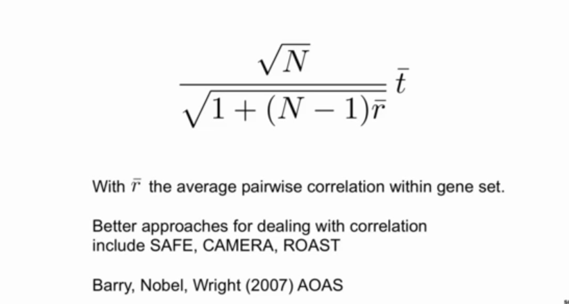

If gene sets are correlated it may be necessary to introduce a correction factor.

# (2'') After applying correction factor ...

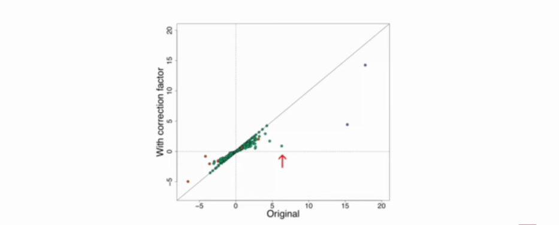

- For most gene sets, it doesn't change much.
- The third gene set, which was not
on chromosome X or chromosome Y and had a pretty large average t-statistic summary has been shrunken down.

# (3) Other summary Statistics

- Changes in variance : F test

- General changes in p-value distribution - Kolmogorov SMirnov Test

- GSEA (Broad's) - Weighted version of K-S test

