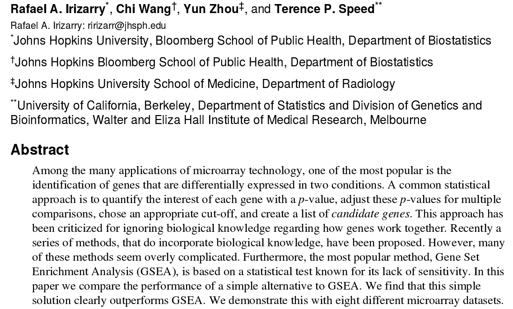
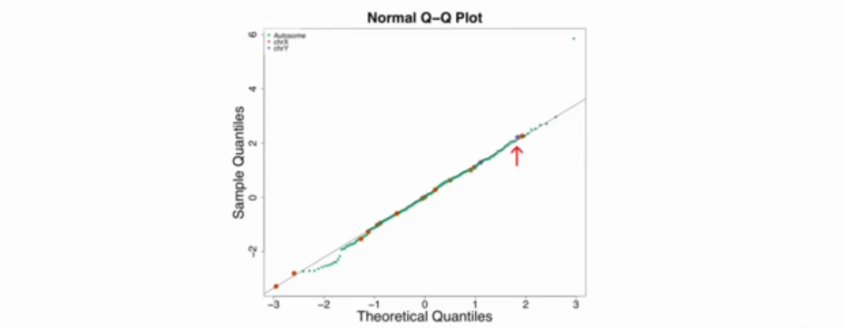
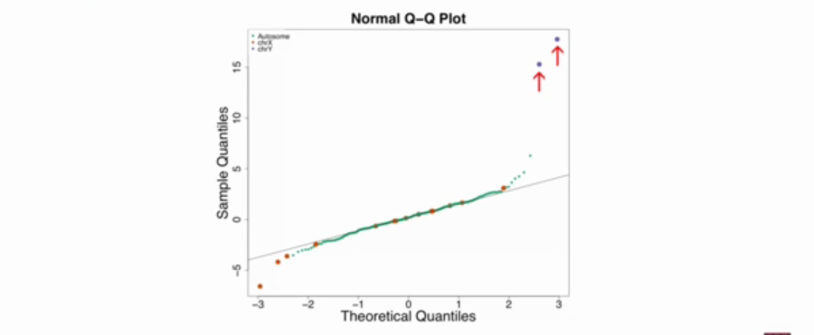

Integrating diverse omic data with gene sets
========================================================
author: Alex Sanchez
date: 2016-02-23

 Background
========================================================

 Cancer projects and Multi Omics
========================================================
- Nowadays it is possible to simultaneously make several [gen]omic measures in the same sample.
- Cancer genome projects have been at the forefront of this trend, and have faced the challenge of integrating these diverse data types [1,2], including _RNA transcriptional levels, genotype variation, DNA copy number variation, and epigenetic marks_

 Leary (2008), PNAS
========================================================

 Gene Sets & Gene Set Analysis
========================================================

 Gene Sets
========================================================

- Integration may be helped by annotated collections of gene sets capturing established knowledge about biological processes and pathways.
- There exist many Collection of gene sets available *MSigDb*

- Because one can make inferences about a given gene set using several different genomic data types, _Gene set analysis provides a direct and biologically motivated approach to analyzing multiple data types in an integrated way_

 Traditional approach
========================================================
- Find some feature-to-phenotype association score (say, using t-test, ANOVA, etc.)
- Rank features according to the score and take top-'your favorite number' of differentially expressed genes. Discard the rest.
- Adjust by Multiple testing

 Some obvious drawbacks
========================================================
- Individual features (genes, proteins, miRNA) might not contribute too much to the difference between phenotypes, together, though, they might!

- It is not uncommon that similar studies report nonintersecting lists of "top genes"
- When selecting different types of features from the same study, connecting them is a complex task.

 Gene Set Analysis
========================================================
- Instead of 'list of genes' think about 'list of gene sets'
- Gene sets encompass larger amount of biological information,
this helps to make results more interpretable.
- Information on the gene set level is comparable across different types of measurements (different platforms)
- Multiple testing issue atenuated: we will usually (not always...) have less sets than individual genes
- Same biological mechanisms can manifest in different parts of the pathway and via different alterations in different
subjects (!!!)

 Overrepresentation Analysis
========================================================

  

 Overrepresentation Analysis Example
========================================================

  
  
  Drawbacks of Overrepresentation Analysis
========================================================

- A small list of differentially-expressed genes that makes for the counts in the two by two tables relatively small, which makes the approximation that we used to obtain p values not very good.
- The definition of differentially-expressed is somewhat arbitrary. We picked a false discovery rate of 5%. We could have picked 10%, 25%, or some other number.

- It is not clear that there's a natural separation: we're going to have a number on the right side that's in the list of differentially-expressed. 
And right next to it a gene that is not in the list
of differentially-expressed genes.

- There are alternatives

Gene Set Enrichment Analysis. Motivation
=======================================

- Imagine we are interested in another Gene Set, Chromossome XP11
- This particular gene set had only one out of the many genes in it called differentially-expressed.
- However, when we look at the distribution of t-statistics,
or the distribution of the effect size, we note that there's a slight shift to the left. 
- GSEA provides methods and tools to compute summary statistics that can be used to summarize effects such as this.
 
Looking at the ChrX p11 gene set
================================
 
 

GSEA made simple
=======================

(1) Wilcoxon test for over-under expression
============================================
Take each gene set and perform a wilcoxon test compared to the rest of the genes

(2) Simple test for the mean shift
====================================
- The simplest statistic to test for a mean shift is the average difference in mean.
- This difference may be summarized with average t-statistics

$$
\overline{t}=\frac 1N \sum_{i\in G} t_i, N=\mbox{size of gene set G}
$$

- If the t statistics are independent we have:

$$
\sqrt{N}\cdot \overline{t}\sim N(0,1)
$$ 

(2) Average t-statistics
=======================

The two highest points are the two genesets in chromosome X and the three lowest points are the three genesets in chromosome Y

(2') If gene sets are correlatied...
=======================

If gene sets are correlated it may be necessary to introduce a correction factor.

(2'') After applying correction factor ...
=======================

- For most gene sets, it doesn't change much.
- The third gene set, which was not
on chromosome X or chromosome Y and had a pretty large average t-statistic summary has been shrunken down.

(3) Other summary Statistics
==============================

- Changes in variance : F test

- General changes in p-value distribution - Kolmogorov SMirnov Test

- GSEA (Broad's) - Weighted version of K-S test
