# Introduction and Objectives

## Introducing myself

:::{.center}
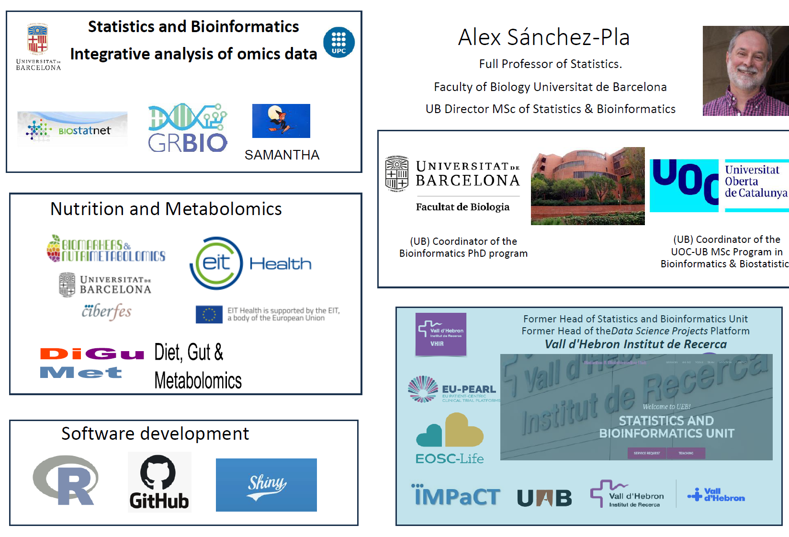{width=80%}
:::

## Introducing Our groups

<br>


## Session objectives

- Overview of Patwhay Analysis for Metabolomics

- Introduce its components and 

- Go through some methods with some detail<br>

- Discuss some limitations and provide recomendations.

- Introduce some tools for Pathway Analysis

- Get a practical grasp of how to apply it.


## Session Outline

1. Introduction and objectives

2. Metabolite lists: What do they mean

3. Information sources to support interpretation

4. Methods and Tools to extract information
  
5. The limitations of PwA. Some recommendations

6. Software tools for PwA

7. Practical session


## Health, Disease and Pathways {.smaller}

- Metabolism is a complex network of chemical reactions within the confines of a cell that can be analyzed in self-contained parts called pathways.

- We often assume that “normal” metabolism is what happens in healthy state or, that disease can be associated with some type of alteration in metabolism.

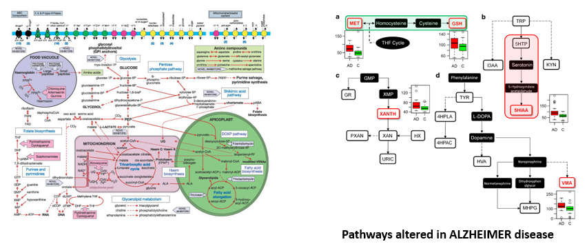

 
## So what is Pathway Analysis?  {.smaller}

- ... any analytic technique that benefits from biological pathway or molecular network information to gain insight into a biological system. (Creixell et alt., Nature Methods 2015 (12 (7))

- Pathway Analysis methods rely on high throughput information provided by omics technologies to: 
  - Contextualize findings to help understand biological processes
  - Identify fetures associated with a disease
  - Predict drug targets
  - Understand how to intervene in disease
  - Conduct target literature searches
  - Integrate diverse biological information

# From samples to *features* lists

## Bioinformatics workflows


```{r, fig.width=100, fig.align='center', fig.cap='[A Metabolomics Worflow Example](https://doi.org/10.3390/metabo12040357)'}
#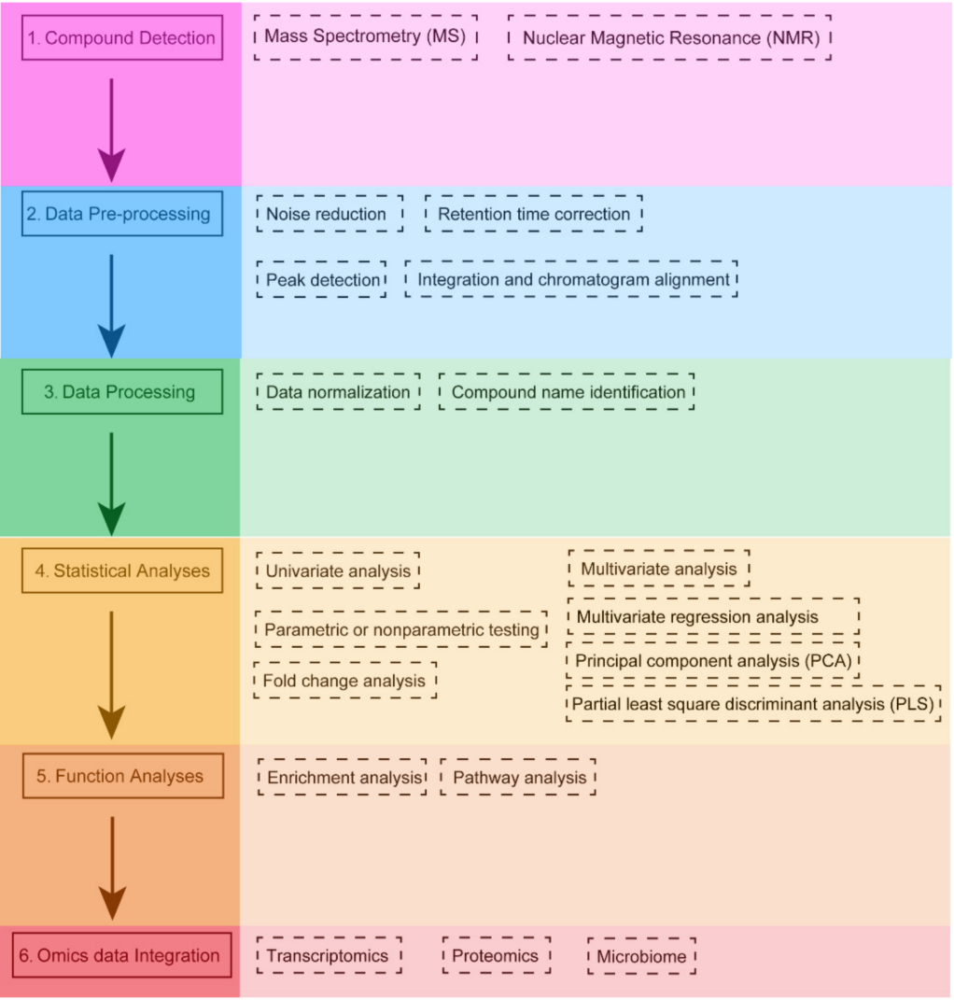
```

](images/PWA-4_Metabolomics-Slides_insertimage_8.png){width=120%}


## From samples to *features* lists (2)

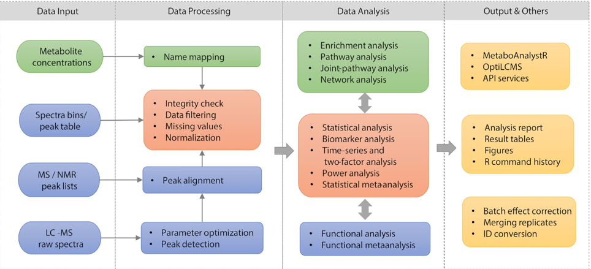

## Analysis yields metabolites lists {.smaller}

- A typical analysis can result in diverse types of metabolite lists:

:::: {.columns}

::: {.column width='40%'}

:::{.center}

<!-- 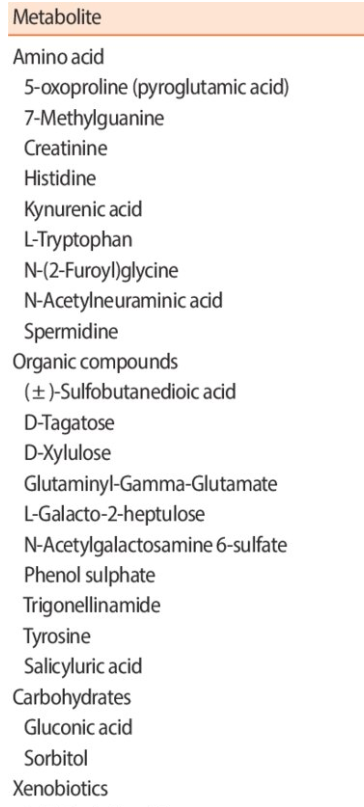{width=50%} -->

```{r echo=FALSE}
library(dplyr)
x <- read.csv("data/cachexia-t_test_all.csv") %>% 
  dplyr::arrange(P.Value) %>%
  dplyr::select(X) %>% rename("Metabolites"=X)
head(x,12)
```
*Top 10 most different metabolites in the Cachexia dataset*

- Truncated
- Unordered
- Only has metabolite IDs

:::
:::

::: {.column width='60%'}
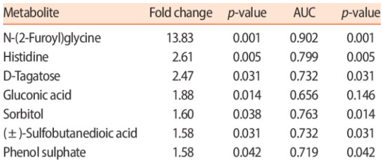

- All the features analyzed
- Ordered or *ranked*
- IDs and *effect size* measures

:::

::::

# Interlude: The names of metabolites

## An open problem: Metabolites IDs

- To be able to do Pathway Analysis, metabolites need to be *mappable* to their sources of information.

  - Must be uniquely identifiable by  names/IDs.
  - Must be possible to link/relate these names/IDs with the corresponding IDs in the source of information we wish to rely.
  
- This is *far from possible* for all metabolites.
- Uniquely and unambiguosly naming all metabolites is, in the best of cases, "work in progress".

## Different annotation levels

<!-- jo aquí diria que això pot dependre de la precisó del mètode de detecció -->
1. **Exact structure**, including stereochemistry and bond geometry
2. **Regiochemistry level** (stereochemistry and bond geometry unknown)
3. **Molecular species level** (regiochemistry unknown)
4. **Species level** (no information on structural features)

## Many sources for names
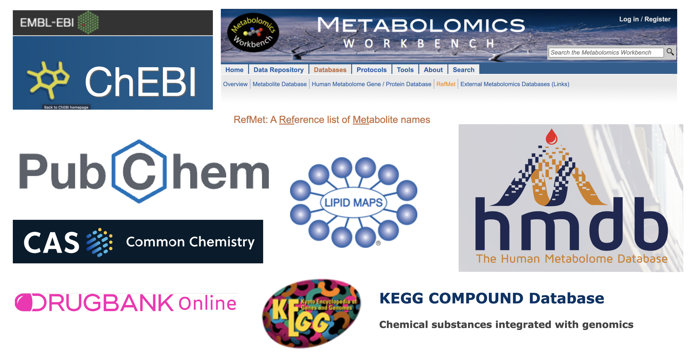

## Many names and descriptors {.smaller}

<!-- jo aquí diria que els més precisos o inequívocs, els computats, són els que menys es fan servir. I no és d'estranyar, vist la pinta que fan-->

- **Common names**
  - E.g. *Cholesterol*. Useful for chemists. 
  - Difficult to track (any small change makes it another name).
- **Identifiers from _popular_ databases**

  - More precise than common names but 
  - With possible discordances among databases.
  
```{r echo=FALSE}
library(metaboliteIDmapping)
cholest <- filter(metabolitesMapping, Name=="Cholesterol")
head(cholest[,4:10])

```

- **Computed descriptors**
  - IUPAC name, InChI, InChIKey,   - SMILES (canonical or isomeric)
  - Informative but hard to manage

## Computed descriptors for Cholesterol

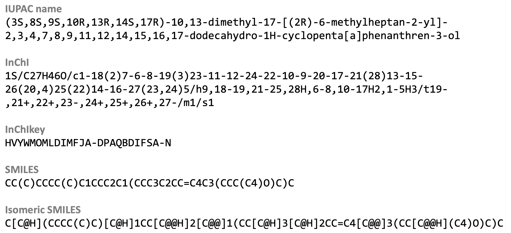

<!-- IUPAC Name: (1S,2R,5S,10S,11S,14R,15R)-2,15-dimethyl-14-[(2R)-6-methylheptan-2-yl]tetracyclo[8.7.0.0^{2,7}.0^{11,15}]heptadec-7-en-5-ol -->
  


## Many synonyms {.smaller}
<!-- i que, precisment, els que més es fan servir, tenen un munt de sinònims -->
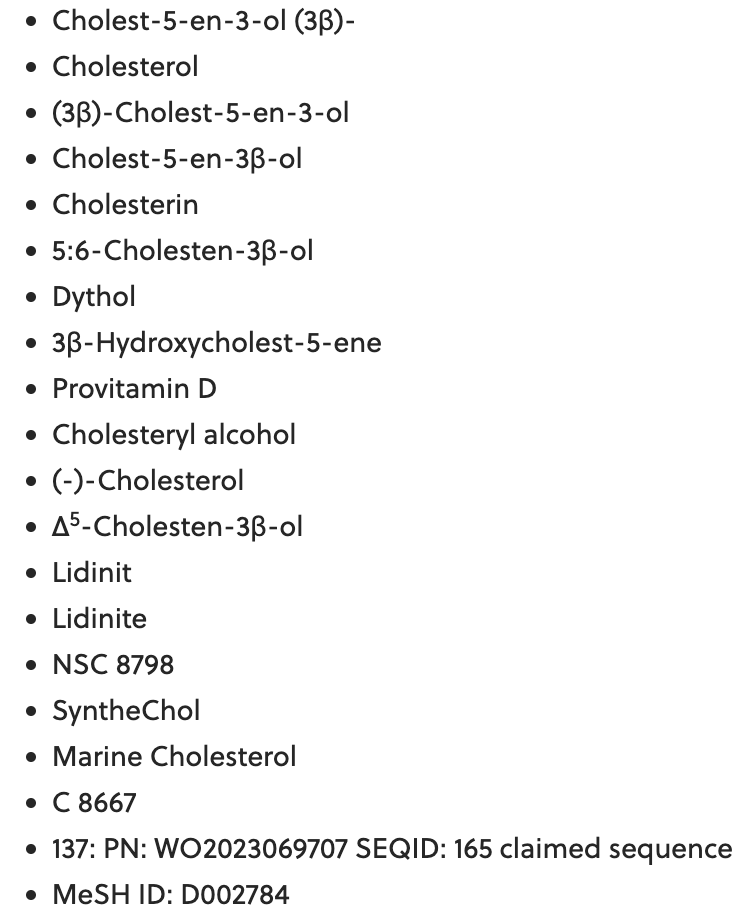


<!-- ## Many solutions {.smaller} -->
<!-- 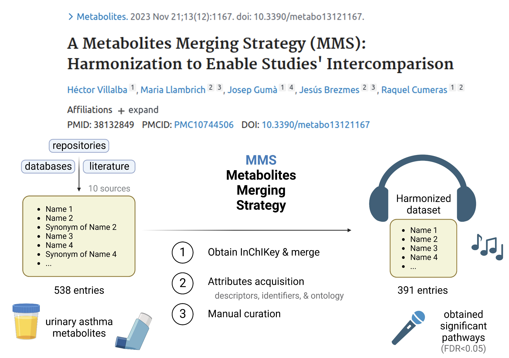 -->

<!-- [https://pubmed.ncbi.nlm.nih.gov/38132849/](https://pubmed.ncbi.nlm.nih.gov/38132849/) -->

## What to do in practice ("real life")

- Try to name your metabolites using standard ids **from the very beginning**

- Locate a dictionary or some id-converter that allows translating from one type of IDs to another *when needed*

- Keep in mind that many translations can end up in missing correspondence so decreasing your list size.

## An example dictionary

::::{.small}
```{r, echo=FALSE}
MW_ST000291__map <- read.csv("./data/MW_ST000291__map.csv")
kableExtra::kable(MW_ST000291__map[1:10,1:6]) %>% kableExtra::kable_styling()
```

- A list of 1358 PubChem identifiers from study [ST000291](https://www.metabolomicsworkbench.org/data/DRCCMetadata.php?Mode=Study&StudyID=ST000291) downloaded from [Metabolomics Workbench](https://www.metabolomicsworkbench.org/) was translated with `MetaboAnalyst ID converter`.
- **Only 623 (646) metabolites had a match in HMDB (KEGG)**.
::::

# Back to Pathway Analysis

## The *where to, now?* question {.smaller}

Once a list of feature is obtained it can be studied on a one-by-one basis

:::: {.columns}

::: {.column width='40%'}

  - Select some features for biochemical validation,
  
  - Map individual features to specific pathways,
  
  - Perform functional assays,
  
  - Do a literature search ...

:::

::: {.column width='60%'}

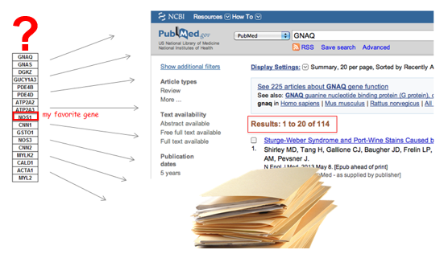

:::

::::

- This will yield useful information, but

  - It may be slow and resource-consuming
  - It does not account for **interaction** between features.

## And here comes Pathway Analysis

- Pathway Analysis (PWA) aims to interpret metabolomics results in terms of biological processes rather than individual compounds.
  - Instead of asking whether one metabolite changes, 
  - It asks whether *a coordinated group of metabolites associated with the same biochemical function shows evidence of perturbation*.
  
## The components of PWA

- With the previous goals in mind most PWA methods combines:
  - The list of features, with
  - Pre-existing sources of information related to them

- And, after some processing, it yields 
  - some type of scores about
  - groups of features appearing to be coordinatedly related with the process being studied.


## How can we interpret these lists?


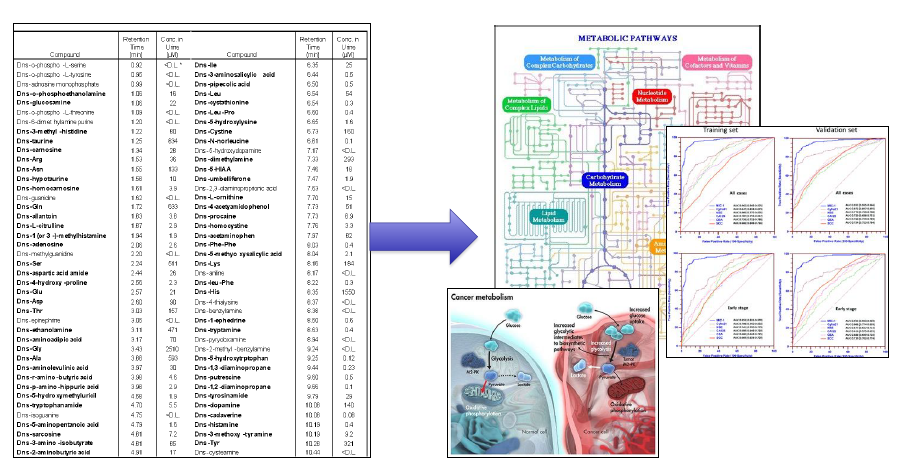

# Ontologies, Databases and Metabolite Sets

## The elements of Pathways Analysis

- Loosely speaking, to do Pathway Analysis one needs:

  - A list of features, characterizing a  process.

  - A source of information about these features.

  - An algorithm to highlight relevant information by linking *list* and *source*.

  - A tool implementing the algorithm.

- In this section, we focus on *sources of information* and on *how to provide it to the algorithms*.


## Sources of information for PWA

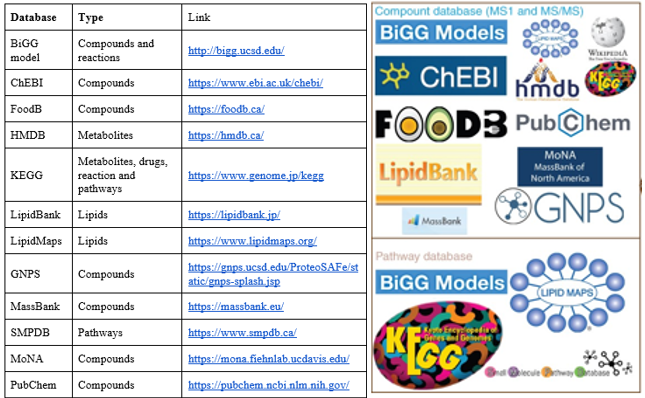

## Ontologies, Databases et alt.{.smaller}

Although incomplete s.o.i are multiple and diverse.

- **Ontologies:** Structured vocabularies for categorizing and describing relationships within a domain. [GO](https://geneontology.org/), [ChEBI](https://www.ebi.ac.uk/chebi/)
- **Pathway Databases:** Detailed information about biological pathways and their the biological context. [KEGG](https://www.genome.jp/kegg/), [Reactome](https://reactome.org/), [SMPDB](https://www.smpdb.ca/).
- **Compound Databases:** Information on small molecules for identification and characterization of metabolites. [HMDB](https://hmdb.ca/), [PubChem](https://pubchem.ncbi.nlm.nih.gov/), [LipidMaps](https://lipidmaps.org/), and [MassBank](https://massbank.eu/MassBank/)
- And many more: **Networks DBs**, **Spectral DBs**, ...

## The  Human Metabolome DB {.smaller}

:::: {.columns}

::: {.column width='40%'}


:::

::: {.column width='60%'}

- Detailed information about human
metabolites, their structures, pathways,
origins, concentrations, functions and
reference spectra
- HMDB has 248,855 metabolites, 132,335
pathways, 3.1 million MS and NMR spectra,
metabolite biomarker data on >600 diseases
- A resource established to provide reference
metabolite values for human disease, human
exposures & population health
- Captures both targeted and untargeted
metabolomics (and exposomics) data

:::

::::


## The Food Constituent Database {.smaller}

:::: {.columns}

::: {.column width='40%'}


:::

::: {.column width='60%'}

- Database of 70,000+ compounds
found in 727 foods and their
effects on flavour, aroma, colour
and human health
- Comprehensive concentration
information to ID foods that are
rich in particular micronutrients
- Links chemistry to food types
(biological species) to flavour,
aroma, colour and human health
- Supports sequence, spectral, structure and text searches

:::

::::


## The KEGG DB {.smaller}

:::: {.columns}

::: {.column width='40%'}

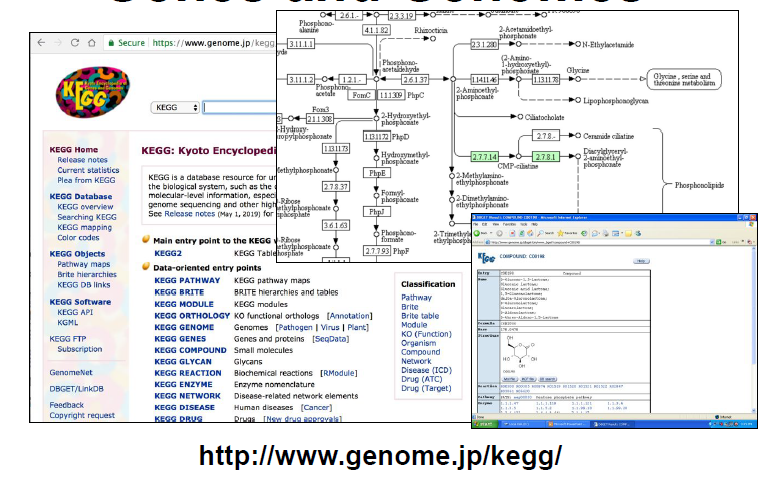

:::

::: {.column width='60%'}

- The “Go-to” Metabolic Pathway Database
- Has 535 “canonical” pathway diagrams or maps covering 5994 organisms for a total of 604,808
pathways
-  ~170 metabolic pathways covering 18,553
compounds, includes many disease pathways (80), protein signaling (70) pathways, and biological
process pathways (70)
-  Metabolic pathways are highly schematized and mostly limited to catabolic and anabolic processes

:::

::::


## Small Molecule Pathway Database {.smaller}

:::: {.columns}

::: {.column width='40%'}

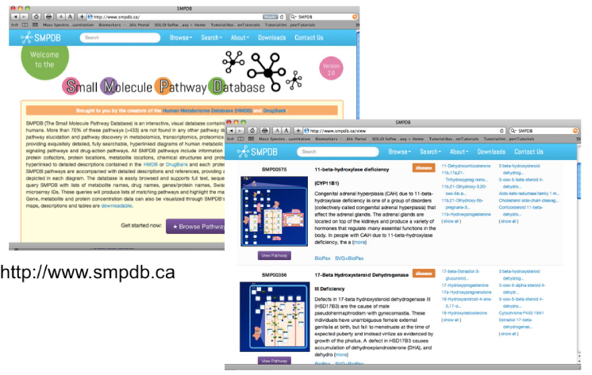

:::

::: {.column width='60%'}

- Nearly 48,900 hand-drawn small molecule pathways
  – 404 drug action pathways
  – 20,251 metabolic disease pathways
  – 27,876 metabolic pathways
  – 160+ signaling and other pathways

- Depicts organs, cell compartments, organelles, protein locations, and protein quaternary structures

- Maps gene chip & metabolomic data

- Converts gene, protein or chemical lists to pathways or disease diagnoses
:::

::::

# Obtaining Metabolite Sets

## PWA and Metabolite Sets

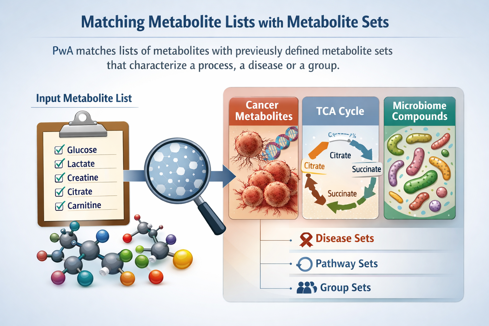

## Sources of Metabolite Sets

- Some sources of information directly provide metabolite sets. E.g: **Chemical Ontologies**, **The KEGG Pathway Database**

- For compound DBs, Metabolite sets may be built
  - By **manual curation**
  - Automatically, eg. using clustering approaches such as **MetaMap** or **Chemical Similarity clustering**
    

## Chemical Ontologies 

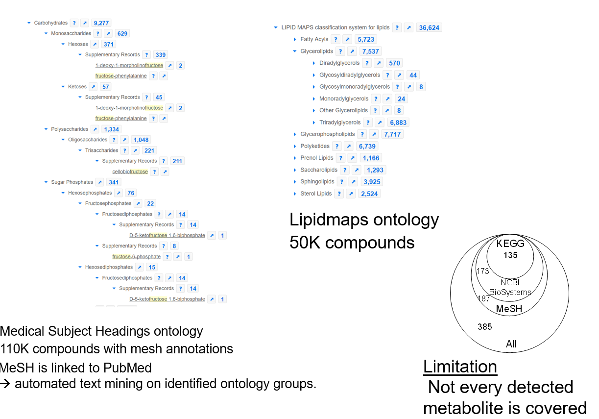


## Metabolites Set libraries

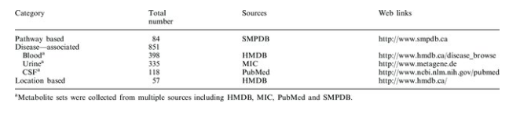

## Metamap clusters

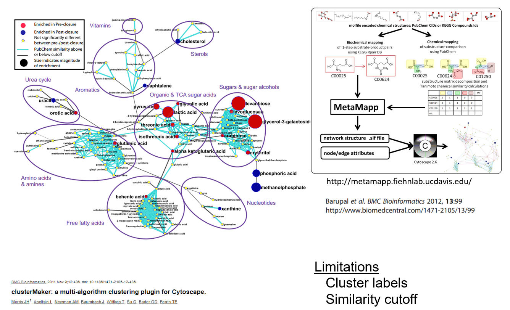

## Chemical similarity clusters

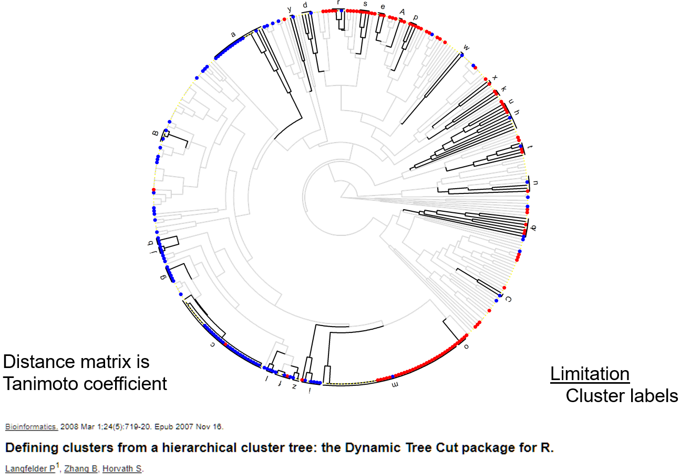


# Analysis Methods

## The main idea of PWA

- Pathway Analysis (PWA) aims to interpret metabolomics results in terms of biological processes rather than individual compounds.
  - Instead of asking whether one metabolite changes, 
  
  - It asks whether *a coordinated group of metabolites associated with the same biochemical function shows evidence of perturbation*.
  
- PWA will usually rely on (1) a list of interesting metabolites and (2) some type of knowledge source.

## Types of Pathway Analysis


](images/PWA-4_Metabolomics-Slides_insertimage2_6.png)

## Before We Begin {.smaller}

### Targeted vs Untargeted Metabolomics

- Metabolomics uses two main experimental approaches: targeted and untargeted.

- In **targeted metabolomics**:
  - The metabolites are identified and quantified beforehand.  
  - This means that each variable in the dataset corresponds to a known compound, which can be directly linked to biochemical pathways.

- In **untargeted metabolomics**: 
  - The data consist of *spectral features* defined by mass-to-charge ratio and retention time.  
  - These features are not directly identified as metabolites and may correspond to multiple possible compounds.

## Targeted vs Untargeted

```{r, fig.align='center', fig.cap="Comparison of targeted and untargeted metabolomics approaches highlighting key features. Videtič Paska, A. (2025) https://BioRender.com/7vhpmxv."}
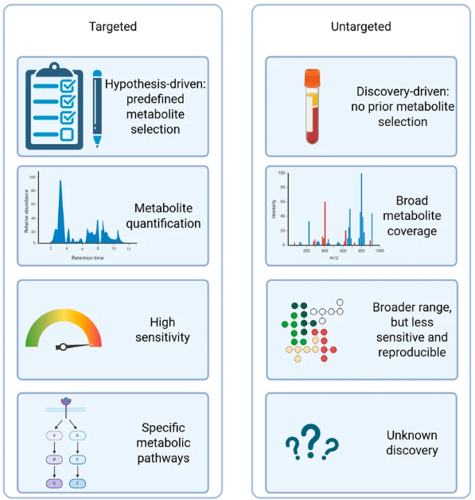
```


## PWA and type of metabolomics {.smaller}

- Pathway analysis is straightforward in targeted metabolomics, but becomes more challenging in the untargeted setting, where annotation is incomplete or uncertain.

- Most classical pathway analysis methods, such as ORA, GSEA and FELLA, are primarily designed for targeted data, where metabolite identities are known.

- For untargeted metabolomics, specific approaches such as Mummichog have been developed to perform pathway analysis directly from spectral features, avoiding the need for full metabolite identification.

## (1): ORA {.smaller}

### Over-representation Analysis

- Given
  - A feature (metabolites) list (from some study).
  - A collection of Pathways (metabolites sets)
  
- The goal is finding out if any of the  Pathways is *surprisingly enriched* in features in the feature list

  - Need to define "surprisingly” (statistics)
  - Need to deal with test multiplicity

## Obtaining feature lists

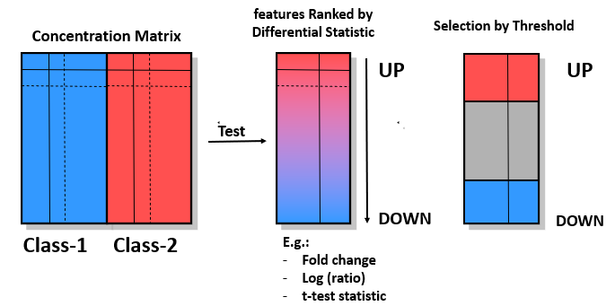

## Assessing "surprisingly" {.smaller}

:::: {.columns}

::: {.column width='60%'}

Given a feature list, “fl”, and a feature set, “FS”, check if the % of genes in “fl” annotated in “FS” the same as the % of genes globally annotated in “FS”?

- If both percentages are similar $\rightarrow$ *No Enrichment*.
- If the % of features in “FS” is greater in “fl” than in the rest of genes $\rightarrow$ *“fl” is enriched in “GS”* 

:::

::: {.column width='40%'}

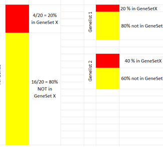

:::

::::

## Example

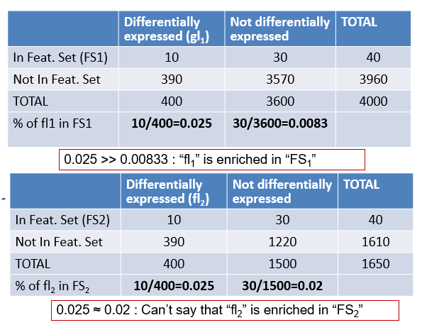

## Assess significance: Fisher test

- The example shows two cases
  - One  where percentages are quite different
  - Another where percentages are similar.
  
- How can we set a threshold to decide that the difference is “big enough” to call it “Enriched”
  - Use Fisher Test or, equivalently,
  - a test to compare proportions or 
  - a hypergeometric test.

## Example 1: Surprisingly enriched


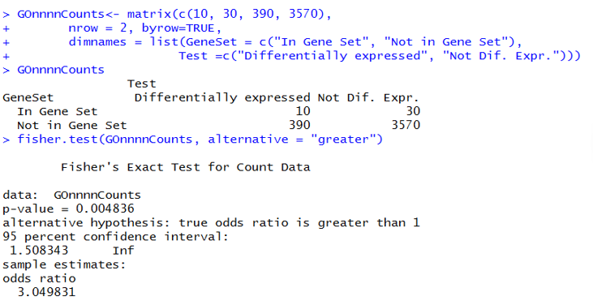


## Example 2: Non-enriched

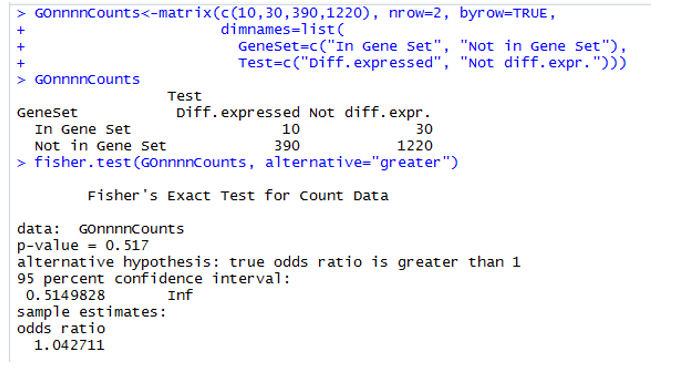


## Summary: Recipe for ORA

1. Define feature list (e.g. thresholding analyzed list ) and background list,

2. Select feature sets to test for enrichment,

3. Run enrichment tests and adjust for multiple testing

4. Interpret your enrichments


## Posible problems with ORA

- No "natural" value for the threshold used to define significance
- Possible loss of statistical power due to thresholding
- No resolution between significant signals with different strengths
- Weak signals neglected
- Different results at different threshold settings.
- Based on the unrealistic assumption of independent feature (or feature group) sampling, which increases false positive predictions.


## (2): Functional Class Scoring {.smaller}

### Gene Set Enrichment Analysis (GSEA)

- Rooted in the  *Gene Set Enrichment Analysis* (GSEA) method developed  to overcome ORA limitations [@Subramanian2005].

- The key innovation of GSEA  is that It avoids dichotomizing the data into significant and non-significant metabolites.
- Instead, it uses all measured metabolites and asks whether the members of a pathway tend to accumulate near the top or near the bottom of a ranked list.

:::{.center}
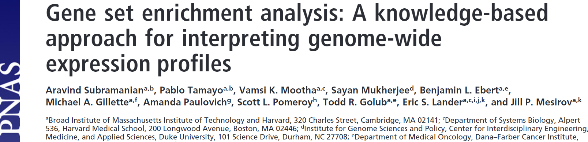{width=60%}
:::

## The GSEA Method (1) {.smaller}

- Core of GSEA is a *running-sum* statistic computed along a ranked list.
  - If a metabolite is in the pathway, the running sum increases; 
  - when it does not belong to the pathway, the running sum decreases. 
- The *Enrichment Score* is the maximum departure from zero and can be summarized as: $ES = \max \left| \sum_{i=1}^{N} w_i \right|$, where the contribution, $w_i>0$ if the i-th metabolite is in the pathway and negative otherwise.
 - Many possible ways to compute  $w_i$. Original GSEA method:
    - If a feature is in the  set:  $w_i=+\sqrt{(N-N_s)/N_s}$.
    - If a feature is not in the set, $w_i=-\sqrt{N_s/(N-N_s)}$.

## Enrichment Scores
  
  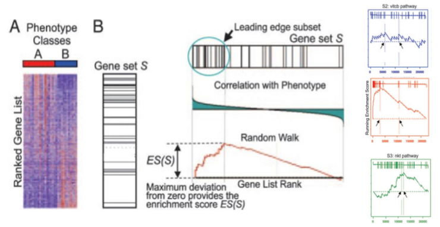
  

## The GSEA tests {.smaller}

- To determine significance of Enrichment Score:
  - Rank all metabolites according to a statistic that captures the contrast of interest. 
  - Computes an enrichment score for each pathway
  - Evaluate significance by comparing the observed score with scores obtained under permutation. 
  - Adjust p-values for multiple testing.

- If the distribution of the *running sum* doesn't differ from a *random walk* then the list can be declared significantly enriched in that set.

- Original test was a Kolmogorov-Smirnov test (K-S test) statistic with P-values  computed by randomization.


## GSEA may improve ORA

- A pathway can contain many metabolites changing moderately but in the same direction. 
- ORA may fail here because very few metabolites cross the significance threshold. 
- GSEA, can still detect these metabolites systematically concentrated near the top or bottom of ranking.

- Interpretation is  more global than in ORA: coordinated patterns may be detected even if no single metabolite is significant by itself.


## GSEA Extensions/Alternatives {.smaller}

- **Wilcoxon test**:  
  I uses rank-based methods to assess whether the feature sets are distributed differently across the groups. 

- **Globaltest**: 
  - It evaluates the association between a predefined set of features and a clinical outcome of interest. 
  - Instead of testing individual features, it assesses the global effect of the gene set on the outcome. 
  - This method is beneficial in identifying pathways or feature sets that have a combined influence on a phenotype, rather than relying on individual feature-level analysis.

## GSEA limitations

- The choice of ranking statistic matters, and different rankings can lead to different conclusions. 
- The method can also be less intuitive  than ORA because the enrichment score is not based on a simple overlap count. 
- In metabolomics, where pathways are often small and annotation is incomplete, its performance may be less robust than in transcriptomics.

## (3): Fella {.smaller}

- A topology-based strategy for metabolomics pathway analysis [@PicartArmada2018].
- Instead of treating pathways as isolated metabolite sets, FELLA uses the structure of the metabolic network itself. 
- In this framework, metabolites, reactions, enzymes and pathways are connected through a graph, and the observed signal is propagated through that graph to identify the most relevant biological context [@Lu2023].

- This is conceptually appealing because metabolism is inherently networked, and a method that incorporates network structure can capture relationships that set-based methods may miss.

## FELLA Method (1) {.smaller}

- FELLA builds a graph from a pathway database, typically KEGG, and then 
- It uses diffusion or PageRank-like algorithms to propagate the evidence associated with the input metabolites through the network [@Lu2023; @Xia2011]. 
- Significance is evaluated by permutation, for example through an expression of the form
$$
P = \frac{r_{perm} \ge r_{obs} + 1}{N_{perm} + 1}
$$
where the observed score is compared with the scores obtained under random input sets.

## FELLA Method (2) {.smaller}

- The workflow begins with a set of annotated metabolites. 
- These metabolites are *mapped to the graph* and a *diffusion step* is performed in order to spread the signal to neighboring reactions, enzymes and pathways. 
- Permutation testing used to assess  significance of the resulting scores.

- This procedure allows the method to exploit indirect relationships, not just direct overlap with pathway members: 
  - If the metabolites detected in a study do not all belong to the same pathway, but several of them are connected through nearby reactions or shared enzymatic context. A set-based method might fail to emphasize that structure, whereas FELLA may reveal that these metabolites jointly point toward a coherent region of the metabolic network.

## FELLA limitations

- The main limitation of FELLA is that it requires annotation, which means that it cannot be directly applied to raw untargeted peak lists. 
- In addition, its results depend strongly on the quality, completeness and biological relevance of the network used. - Finally, topology-based methods are typically more computationally demanding and sometimes more difficult to explain than set-based methods [@Khatri2012; @Lu2023].

## (4): Mummichog

- What to do when you don’t know what the metabolites ions are?

- Most popular option is Mummichog [@Li2013], a method that *bypasses the requirement of full metabolite identification* before pathway analysis.

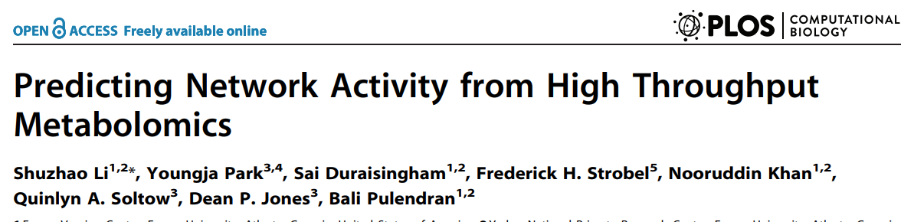

## Mummichog pathway mapping {.smaller}

- The method is based on a simple but powerful intuition: 
  - If the data contain true biological signal, then *the candidate metabolites associated with the significant features should collectively point to a limited number of pathways*. 
  - In contrast, false matches are expected to scatter more randomly across the pathway database

## Mummichog Method (1)

- The method starts from an **untargeted peak list** 
- and builds pathway evidence before exact metabolite identification has been completed.

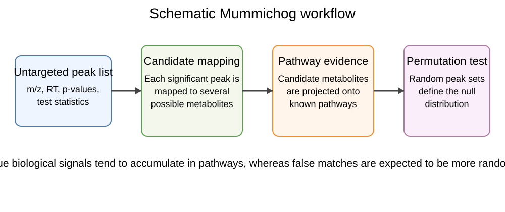{fig-alt="Schematic workflow of Mummichog in untargeted metabolomics." width=92%}

## Mummichog Method (2) {.smaller}

- Mummichog starts from a table of untargeted features with associated p-values or other statistics.
- From here a subset of (the most) significant features is selected.
- Each feature is matched to *one or more* candidate metabolites according to its mass/charge (m/Z) ratio. 
- Candidate metabolites are projected onto pathways, and an ORA-like enrichment calculation is performed *to determine whether the observed pathway evidence is stronger than random expectation*.
  - It differs from classical ORA in that significance is assessed by permutation under a feature-based null model rather than by relying on the analytical hypergeometric distribution. 
  - Mummichog is described as an ORA-based method that *improves recall*, although often *at the cost of lower precision* [@Lu2023].


## Mummichog change of approach

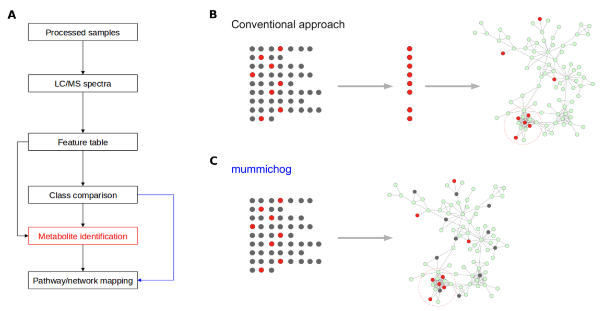

::: {.notes}

1. (A) In the work flow of untargeted metabolomics, the 
conventional approach requires the metabolites to be identified before pathway/network analysis, while mummichog (blue arrow) predicts
functional activity bypassing metabolite identification. 

2. (B) Each row of dots represent possible matches of metabolites from one m/z feature, red the
true metabolite, gray the false matches. The conventional approach first requires the identification of metabolites before mapping them to the
metabolic network. 

3. (C) mummi hog maps all possible metabolite matches to the network and looks for local enrichment, which reflects the true activity because the false matches will distribute randomly
:::

## A mummichog pseudo-example

- Imagine a dataset with 1000 peaks where the top (most significant) 100 peaks are retained. 
- Even if their identities are not known, many may still map to overlapping sets of candidate metabolites.
- If a relevant biological pathway is truly perturbed, those candidates will tend to accumulate in that pathway more strongly than expected by chance.

- The interpretation is therefore probabilistic and pathway-centered rather than metabolite-centered.

## Mummichog: limitations

- Because multiple candidate metabolites can be assigned to each feature, the method may generate false positives. 
- Its performance depends on the quality and coverage of the pathway database and on the quality of the mass matching step.
- The output is extremely useful for hypothesis generation, but it should not be confused with definitive metabolite identification.


## Comparison of the four  {.smaller}

| Method     | Family    | Input          | Strength                                              | Limitation                          |
|-------------|----------------|------------------------|------------------------------------------------------------|------------------------------------------|
| ORA         | Set-based      | Significant metabolite list | Simple, intuitive and easy to communicate               | Depends on an arbitrary threshold        |
| GSEA        | Functional class scoring | Ranked metabolite list | Detects coordinated  changes without thresholding | Depends on ranking and annotation        |
| Mummichog   | ORA-like untargeted data| Untargeted peak list | Works before full metabolite identification              | Can increase false positives             |
| FELLA       | Topology-based | Annotated metabolites  | Incorporates network context and indirect relationships   | Requires annotation and more computation |

## PWA Methods summary {.smaller}

- There is no universally best method for pathway analysis in metabolomics. 
- ORA is simple and often useful as a baseline. 
- GSEA is attractive when one expects coordinated moderate changes across a pathway.
- FELLA adds network context and can be very informative when reliable annotation is available.
- Mummichog is especially valuable for untargeted LC-MS data because it allows pathway-level interpretation before complete identification. 
- In practice, the best choice depends on the study design, the annotation level, the biological question, and the balance one wishes to strike between interpretability, sensitivity and specificity [@Khatri2012; @Karnovsky2020; @Lu2023].


# Limitations and Recommendations

## Some limitations {.smaller}

- Incomplete Pathway Databases

- Metabolite Misidentification

- Chemical Bias of Assays

- Background Set Selection

- Selection of Compounds of Interest

- Multiple testing issues


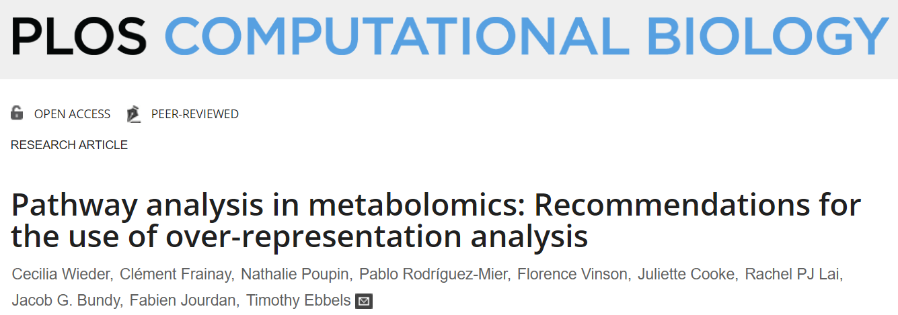

::: {.notes}

### Incomplete Pathway Databases

Limitation: Pathway databases are often incomplete and evolve over time, leading to discrepancies in pathway coverage and definitions.
Recommendation: Use up-to-date databases and consider integrating multiple databases to improve coverage and accuracy​​.

### Metabolite Misidentification

Limitation: Metabolite misidentification can result in both false-positive and false-negative pathway identifications.
Recommendation: Utilize stringent identification criteria and multiple identification methods to minimize misidentification rates​​.

### Chemical Bias of Assays

Limitation: Different analytical platforms have biases toward detecting specific types of compounds, affecting pathway accessibility.
Recommendation: Combine multiple assay types to cover a broader range of metabolites and acknowledge assay-specific biases in the analysis​​.

### Background Set Selection

Limitation: The choice of background set can significantly influence the results of over-representation analysis (ORA).
Recommendation: Define an assay-specific background set that includes all detectable compounds to reduce false-positive pathways​​.

### Selection of Compounds of Interest

Limitation: The criteria for selecting compounds of interest (e.g., significance thresholds) greatly impact PA results.
Recommendation: Use appropriate statistical thresholds and apply multiple testing correction methods to ensure robust selection of compounds of interest​​.

### Lack of Ground-Truth Datasets

Limitation: The absence of ground-truth datasets makes it difficult to validate PA methods and results.
Recommendation: Develop and use simulated or experimental ground-truth datasets to better assess PA methods and improve their accuracy

:::


# Pathway Analysis Tools

## Pathway Analysis Tools

::: {.center}

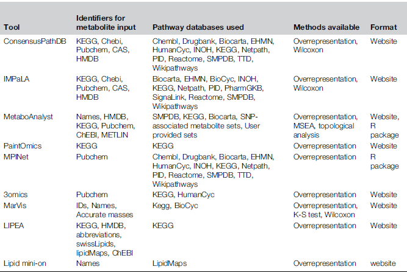

:::
## A comparison of tools

::: {.center}

 ](images/PWA-4_Metabolomics-Slides_insertimage2_26.png)
:::

## The space of tools (in 2017)

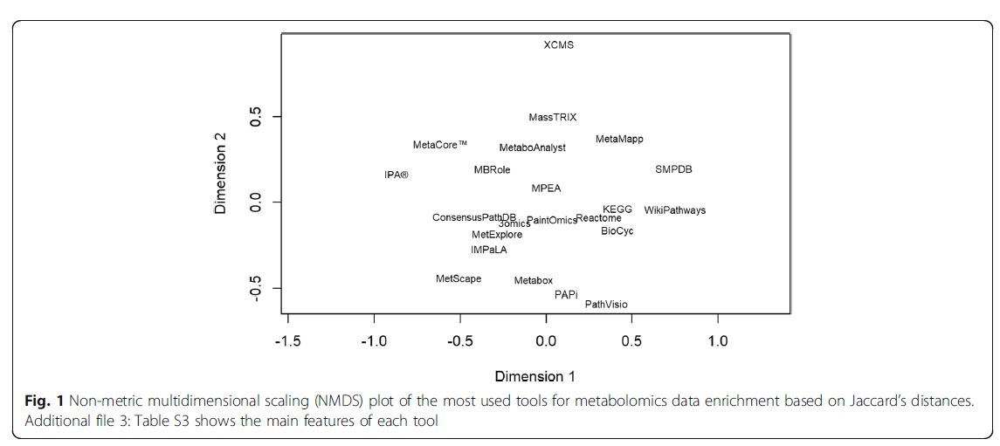

## Not the same, not that different


- ORA tools provided consistent results among tools revealing that these analyses are robust and reproducible regardless of their analytic approach.

- Redundancy of identifiers, Use of chemical class identifiers and Incompleteness of databases sets limit the extent of the analyses and reduce their accuracy. 

- More work in the completeness of metabolite/pathway databases is required to get more accurate and global insights of the metabolome.
# Summary, and all that

## Summary

- Pathway Analysis is a useful approach to help gain biological understanding from omics-based studies.

- There are many ways, many methods, many tools

- Guide the choice by
 a combination of *meaning*, *availability*, *ease of use* and *usefulness*. 

- Usually obtained from a good understanding of what it does and ow it is done.

- Different methods may yield different results.
<br>Worth checking!

## Acknowledgements


# APPENDICES

# Multiple testing problem and adjustments

## Multiple testing

- Whatever approach we use for pathway Analysis there is a common characteristic: 
*Every test is applied for every feature set in a long collection of sets*

- This leads to a *multiple testing problem*: the Type I error probability of falsely rejecting the null hypothesis increases with the number of tests.

- In order to avoid an artificial inflation of *False positive discoveries* some adjustments are recommended.

## Hypothesis Tests Decision Table

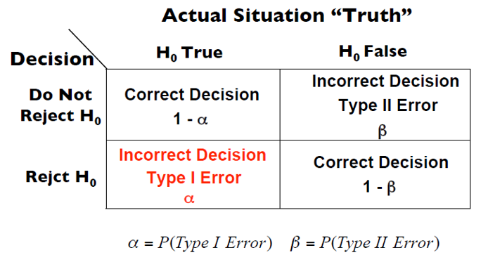

## Why Multiple testing matters

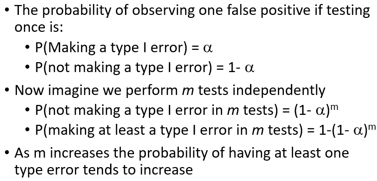

## TYpe I error not useful here

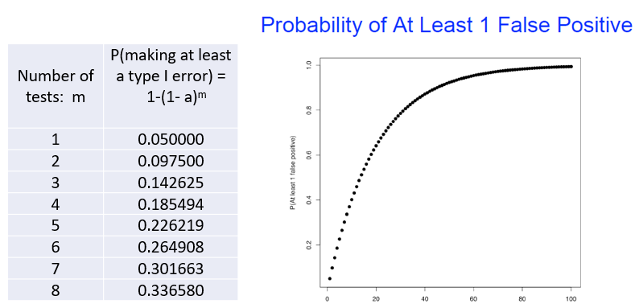

## How to deal with this issue?

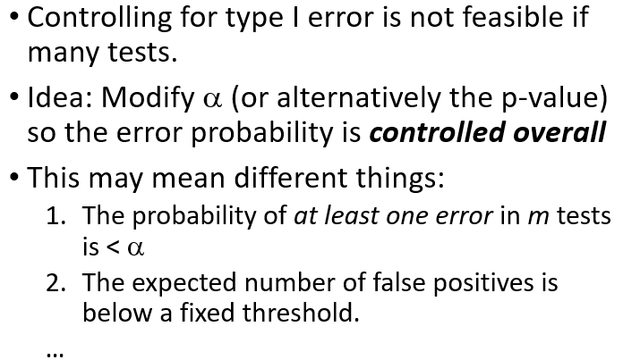

## *Family Wise Error Rate*

- Let $M$ be the number of annotations tested.
- Given p-value, $p$  compute $p_{adj}=p\times M$, or 
- Given significance level $\alpha$ compute $\alpha_{adj}=\alpha/M$.

- The adjusted P-value, $p_{adj}$ is  greater than or equal to the probability that **one or more** of the observed enrichments are due to random draws.  

- This adjustment is said to *controling for the Family-Wise Error Rate* (FWER).

- Bonferroni method controls FWER.


## Bonferroni Caveats

- This adjustment is very stringent and can “wash away” real enrichments leading to false negatives,

- Often one is willing to accept a less stringent condition, that is accepting some false positives to avoid too many false negatives.

- This is may be done using the “*false discovery rate*” (FDR), which leads to a gentler correction when there are real enrichments.

## False Discovery Rate

- FDR is the expected proportion of "False Positives" that is of the observed enrichments due to chance.
- Less restrictive than Bonferroni adjustment which is a bound on the probability that **any one** of the observed enrichments could be due to random chance.
- Typically, FDR adjustments are calculated using the Benjamini-Hochberg procedure.
- FDR threshold is often called the “q-value”

## An example {.smaller}

```{r echo=FALSE}
cachexia.t_test <- read.csv("data/cachexia-t_test_all.csv", row.names=1)
rawPs <- cachexia.t_test$P.Value
names(rawPs) <- row.names(cachexia.t_test)
bonfP <- p.adjust(rawPs, method= c("bonferroni"))
bhP <-  p.adjust(rawPs, method= c("BH"))
pVals <-data.frame(raw = rawPs, Bonferroni=bonfP, FDR = bhP)
Ordered <-round(pVals[order(pVals$raw),] ,6)
kableExtra::kable(Ordered)
```

## References